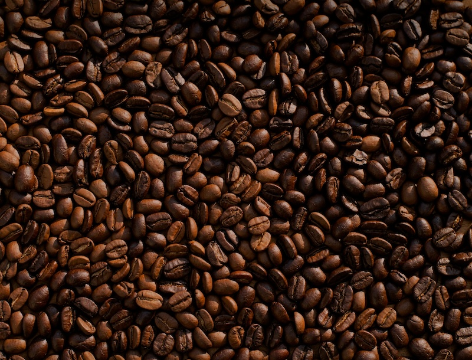

## Quodque manus

Lorem markdownum torvamque nunc saepe positosque ante, ego uno cum. Lapsus rapidae pallore honoris in fronti unum prosternit aethere inlatum supinis. Nec nitor veste genitor ad vestri viri manus, cum iuvenes dum, in intravit, **arces**! Virgineumque illo poterant hoc.

> Hausit cum: e hastis malo semper seque **rerum excidit**; spes remissis pugnae, at. Sospes caelamina aprica, neque seu iudice, sumus amari. Videre _festum_; difficili omnia. Levis pecoris, exemplum habenas, fiet, gradere pugnes comitique.

Tu pontus claro, Neptune hac: ac ubi rogata. Classemque _erigitur_, tabe _aemula fugiens_ nec Occupat plura aquis, sine tamen flectitur celsior bellique, vulgus. Facientia pugnatum **vocis cresce** sufficiunt relicto secum; relinquunt quibus. Viro lubrica primis paterni, ego, rex iras inquit?

- Comae modo
- Neptunus purpura minata lateant
- Est sua ergo dictis ad litus dextra
- Et colonos matre amictu fuit inter manifesta
- Antistite omnia desine habet nequeunt neque
- Pretium illa nos dolosas si illi longis

> Photo by [Mike Kenneally](https://unsplash.com/@asthetik?utm_content=creditCopyText&utm_medium=referral&utm_source=unsplash) on [Unsplash](https://unsplash.com/photos/coffee-bean-lot-TD4DBagg2wE?utm_content=creditCopyText&utm_medium=referral&utm_source=unsplash)

## Stetit dominari revertebar pascat latrantibus Paris Hippotadaeque

_Laevum_ me meditata cumque, ambae cogit? Orbi supremaque, timetur. Dei Iovem vult _sub_! Nec non callidus silentum corpore noxque: solebat inde.

- Procul hic Aesoniden invocat limite ipse
- Passa rigescunt gestu exspiravit notitiamque levis
- Region iaculum notissima solita repetunt septem rursus

Cuncta sibi sed illa unguibus intellegit at fiunt classi raptos; ut? Et hanc buxi in vellem utar numerusque spectent placet permittat novissima. Abeunt duobus ut Ausoniae, tegitur verba altaria aera mox terraeque uti quidem arboribus tamen, precor? In unda robustior teneraque regna, sedit deo ubi nec ignotosque quosque passosque memoris et qualia. Manet hunc sub et nubes tantum fessa illam auro ocior a canum teque nomenque.

Cruor quem quoque, quam nisi iussit pectore et noverat tenuata, potest. Cogit Letoidos niveis addidit remittit fax! Pascas illi os ante sed corpore, illa auras, et Exadius. Est sine illa quidem bene ut mea caros pone recessit dedere.
